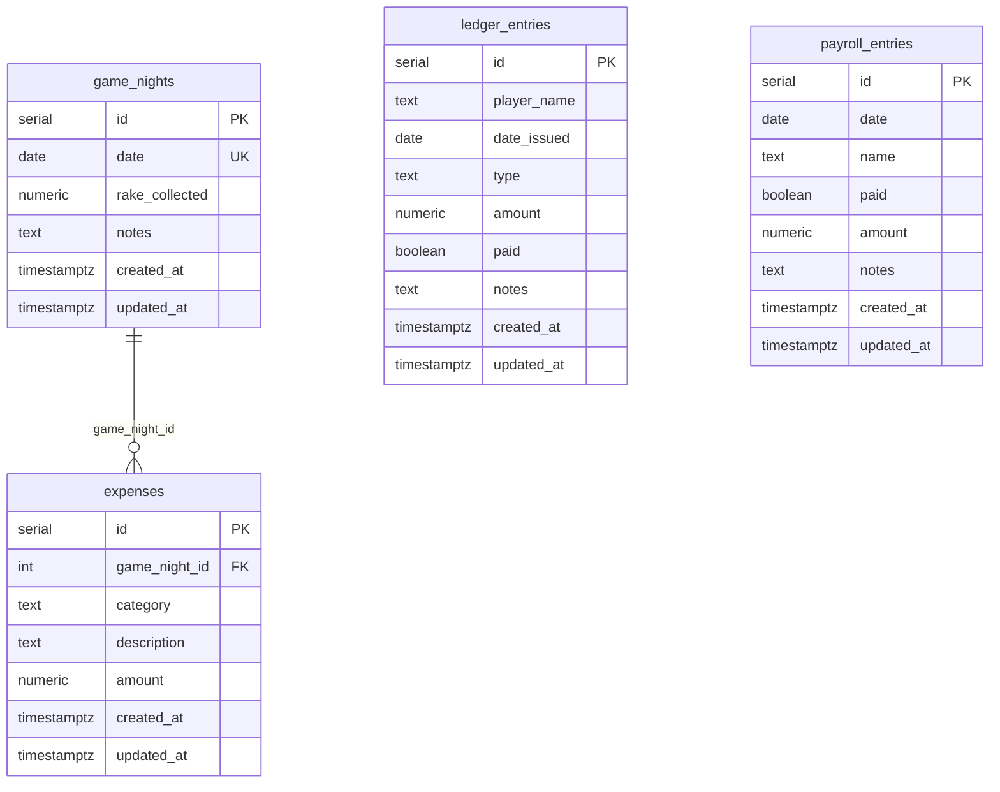

# Private Poker Finance Tracker Web App

## Current Status

**Repository:** [github.com/owenwalSe7en/The_Bunker_Finances](https://github.com/owenwalSe7en/The_Bunker_Finances)

| Phase | Status | Notes |
|-------|--------|-------|
| Phase 1: Scaffolding + Auth | **Done** | Next.js 15, Supabase Auth, Google OAuth, email allowlist middleware |
| Phase 2: Database Schema + Layout | **Done** | 4 tables pushed to Supabase, responsive sidebar, protected layout |
| Phase 3: Game Nights + Expenses | **Done** | CRUD with expandable expense rows, computed net profit, totals |
| Phase 4: Ledger (The Books) | **Done** | Two-tab view, paid/unpaid toggle, summary cards |
| Phase 5: Payroll | **Done** | CRUD with paid/unpaid toggle, totals |
| Phase 6: Dashboard | **Done** | 7 stat cards, weekly P&L chart with cumulative toggle |
| Local testing | **Done** | All routes, auth guard, DB queries verified with seeded data |
| Google OAuth setup | **Not started** | Needs Google Cloud Console config (see Phase 1 manual steps) |
| Vercel deployment | **Not started** | Repo pushed to GitHub, ready to import |

### What works now
- `npm run dev` runs the full app locally
- Database is live on Supabase with seeded test data (6 game nights, expenses, ledger entries, payroll)
- All protected routes redirect to `/login` when unauthenticated
- Login page renders with Google OAuth button

### What's needed to go live
1. Configure Google OAuth in Google Cloud Console (Client ID + Secret)
2. Add Google credentials to Supabase Auth → Providers → Google
3. Set Supabase redirect URLs (`http://localhost:3000/auth/callback` + production URL)
4. Deploy to Vercel with env vars
5. Update Supabase Site URL to production domain

---

## Overview

Replace the "Bunker Black Book" Excel spreadsheet with a private, mobile-friendly web app for tracking poker game finances. The app is locked down so only allowlisted users can access it, uses free-tier hosting, and faithfully replicates the spreadsheet's tracking capabilities.

This is a small-scale private app — one operator, a handful of friends, one poker table. Every architectural decision reflects that scope.

## Spreadsheet Data Model Mapping

The Excel file (`The Bunker Black Book.xlsx`) contains 5 sheets. Here is how each maps to the app:

### Sheet 1: "Nightly Finances" (Primary financial tracking)

This is the core sheet. It has 3 distinct sections:

| Section | Columns | Purpose | Maps To |
|---------|---------|---------|---------|
| **Global Vars** | Kam Nightly Pay ($330), Rake per Pot ($6), Monthly Tournament ($400) | Config constants | `src/lib/constants.ts` |
| **Food + Drink Log** | Date, Week Number, Category, Description, Amount | Per-night expense tracking | `expenses` table |
| **Game Log** | Date, Week Number, Night (day-of-week), Rake Collected, Food + Drink (computed), Net Profit (computed) | Per-game-night summary | `game_nights` table |
| **Pantry** | Item, Full Stock, Current Stock, Need To Buy (computed) | Inventory tracking | Post-MVP |

**Key formulas:**
- `Night` = day-of-week derived from Date — computed in UI, not stored
- `Food + Drink` = SUM of expenses where expense.game_night_id matches
- `Net Profit` = Rake Collected - Food & Drink total - Kam Nightly Pay ($330)
- `Week Number` = derived from date via `EXTRACT(WEEK FROM date)` — computed in queries, not stored

### Sheet 2: "The Books" (Debt/Lending Ledger)

Two side-by-side ledgers:

| Ledger | Columns | Purpose |
|--------|---------|---------|
| **Left: Game Debts** | Date Issued, Player, Paid Back? (YES/NO), Amount, Notes | Tracks money lent to players during games |
| **Right: Free-Play** | Date Issued, Player, Paid/Not Paid, Amount, Notes | Tracks "free-play" credits given to players |
| **Authorized Players** | List of player names (Lukas, Quinn, Drew, Tate, Stove, Henry, Kam) | Who is allowed to play |

Both ledgers map to a single `ledger_entries` table with a `type` field (`game_debt` | `free_play`). Player names are stored as text — 7 names do not warrant a normalized `players` table in MVP.

### Sheet 3: "Payroll"

| Section | Columns | Purpose |
|---------|---------|---------|
| **Dealer Schedule** | Date, Day-of-Week, Dealer Name | Who dealt on which nights — Post-MVP |
| **MGMT Payroll** | Week Number, Name, Paid (Yes/No), Amount, Notes | Management/staff payments |

Maps to `payroll_entries` table.

### Sheet 4: "Long-Term Finances"

| Columns | Purpose |
|---------|---------|
| Week Number, Revenue, Expenses, Weekly Profit | Aggregated weekly profit/loss |
| All-Time Profit (SUM of all Weekly Profit) | Running total |

**Key formulas:**
- `Revenue` = SUM of Rake Collected for that week (from game_nights)
- `Expenses` = SUM of expenses for that week + SUM of Payroll for that week + Kam Nightly Pay ($330/night)
- `Weekly Profit` = Revenue - Expenses

This is a **computed view** — no separate table needed. Dashboard queries aggregate from `game_nights`, `expenses`, and `payroll_entries`.

### Sheet 5: "Leaderboard" — Post-MVP

Player attendance tracking, point system, and monthly/all-time rankings. Deferred entirely — no tables, no schema, no placeholder code until this feature is built.

---

## Database Schema (Drizzle ORM)

### Design Decisions

1. **No `user_id` on data tables.** This is a private app with an email allowlist. All allowlisted users share the same data (one poker game, one set of books). The middleware email check is the security gate — not per-row ownership.
2. **No RLS policies on data tables.** With shared data and middleware-enforced auth, per-row RLS adds friction (every insert/query must include user_id) for zero practical security benefit. The Supabase anon key + middleware guard is sufficient.
3. **No `day_of_week` or `week_number` stored columns.** Both are trivially derived from `date` and storing them creates data integrity risks. Computed in queries or UI.
4. **No key-value `app_settings` table.** Three known constants go in a config file. If they ever need DB-backed editing, it is a single-row typed table — not a generic EAV store.
5. **No `players` table in MVP.** Player names are stored as text on `ledger_entries`. Seven names do not justify a normalized entity with foreign keys, a management page, and CRUD actions.
6. **No post-MVP tables in MVP schema.** `dealer_schedule`, `player_attendance`, and `players` are created when their features are built.
7. **Integer primary keys.** UUIDs are unnecessary for a small-data app. Serial integers are simpler, faster for indexes, and produce cleaner URLs.

### ERD



### Table Definitions

**`game_nights`** — One row per game night
- `id` serial PK
- `date` date NOT NULL UNIQUE — only one game night per date
- `rake_collected` numeric DEFAULT 0
- `notes` text
- `created_at` timestamptz DEFAULT now()
- `updated_at` timestamptz DEFAULT now()

**`expenses`** — Food, drink, restock, and other expenses linked to a game night
- `id` serial PK
- `game_night_id` integer FK → game_nights(id) ON DELETE CASCADE — nullable for expenses not tied to a specific night
- `category` text NOT NULL (`in_game_food` | `restock` | `other`)
- `description` text
- `amount` numeric NOT NULL
- `created_at` timestamptz DEFAULT now()
- `updated_at` timestamptz DEFAULT now()

**`ledger_entries`** — Debts and free-play credits
- `id` serial PK
- `player_name` text NOT NULL
- `date_issued` date NOT NULL
- `type` text NOT NULL (`game_debt` | `free_play`)
- `amount` numeric NOT NULL
- `paid` boolean DEFAULT false
- `notes` text
- `created_at` timestamptz DEFAULT now()
- `updated_at` timestamptz DEFAULT now()

**`payroll_entries`** — Staff/management payments
- `id` serial PK
- `date` date NOT NULL
- `name` text NOT NULL
- `paid` boolean DEFAULT false
- `amount` numeric NOT NULL
- `notes` text
- `created_at` timestamptz DEFAULT now()
- `updated_at` timestamptz DEFAULT now()

### Indexes

```sql
CREATE INDEX idx_game_nights_date ON game_nights(date);
CREATE INDEX idx_expenses_game_night_id ON expenses(game_night_id);
CREATE INDEX idx_ledger_entries_paid ON ledger_entries(paid);
CREATE INDEX idx_payroll_entries_date ON payroll_entries(date);
```

---

## Tech Stack

| Layer | Technology | Notes |
|-------|-----------|-------|
| Framework | Next.js 15 (App Router) + TypeScript | Server Components + Server Actions |
| Hosting | Vercel (free tier) | 100 GB bandwidth, 150k fn invocations/mo |
| Database | Supabase Postgres (free tier) | 500 MB storage, projects pause after 7d inactivity |
| Auth | Supabase Auth (Google OAuth) | 50k MAUs on free tier |
| ORM | Drizzle ORM | `prepare: false` for Supabase pooling |
| Styling | Tailwind CSS + shadcn/ui | Copy-paste components, full customization |
| Validation | Zod | Server action validation via `drizzle-zod` |
| Charts | Recharts | Client component, ResponsiveContainer |

**Not using (removed from original plan):**
- ~~`@tanstack/react-table`~~ — Plain HTML tables with shadcn/ui Table component. Data volumes are 100-200 rows/year; no need for a headless table abstraction.
- ~~`react-hook-form` / `@hookform/resolvers`~~ — Plain `<form>` elements with Server Actions. Next.js 15 handles form submission natively; client-side form state management is unnecessary for simple CRUD forms.

---

## Security Architecture

### 1. Authentication Flow

```
User clicks "Sign in with Google"
  → Supabase OAuth redirect to Google
  → Google authenticates, redirects to /auth/callback
  → Server exchanges code for session
  → Middleware checks: is user's email in ALLOWED_EMAILS env var?
    → YES: continue to /game-nights (default route)
    → NO: sign out, redirect to /not-authorized
```

### 2. Allowlist Enforcement

**Single layer: Middleware.** The middleware checks the authenticated user's email against a `ALLOWED_EMAILS` environment variable (comma-separated list). This is simpler and faster than a database query on every request, and the allowlist changes approximately never.

```typescript
// src/middleware.ts (pseudocode)
const allowedEmails = process.env.ALLOWED_EMAILS?.split(',') ?? []
const { data: { user } } = await supabase.auth.getUser()

if (user && !allowedEmails.includes(user.email)) {
  await supabase.auth.signOut()
  return NextResponse.redirect('/not-authorized')
}
```

If the allowlist ever needs to grow dynamically, upgrade to a database table at that point.

### 3. Key Management

- `NEXT_PUBLIC_SUPABASE_URL` + `NEXT_PUBLIC_SUPABASE_ANON_KEY` → client-side (safe)
- `SUPABASE_SERVICE_ROLE_KEY` → server-side only (never in `NEXT_PUBLIC_*`)
- `DATABASE_URL` → server-side only (Drizzle connection, pooled via port 6543)
- `ALLOWED_EMAILS` → server-side only (checked in middleware)

### 4. Error Handling Convention

All server actions return `{ success: true }` or `{ error: string }`. Pages use the `useActionState` hook (Next.js 15) to display errors inline. Toast notifications via shadcn/ui `toast` for success confirmations and destructive actions.

---

## Implementation Plan

### Phase 1: Project Scaffolding + Auth

**Files to create/modify:**

- [x] `package.json` — Initialize Next.js 15 project with TypeScript
- [x] `next.config.ts` — Next.js configuration
- [x] `tailwind.config.ts` — Tailwind + shadcn/ui theme
- [x] `drizzle.config.ts` — Drizzle Kit config (schema path, migration output, direct Supabase connection)
- [x] `src/app/globals.css` — Tailwind imports + shadcn/ui CSS variables
- [x] `src/app/layout.tsx` — Root layout with font, metadata
- [x] `.env.local.example` — Template for required env vars
- [x] `.gitignore` — Include `.env.local`, `node_modules`, `.next`
- [x] `components.json` — shadcn/ui config
- [x] `src/lib/supabase/client.ts` — Browser client (`createBrowserClient`)
- [x] `src/lib/supabase/server.ts` — Server client (`createServerClient` with cookie handling)
- [x] `src/lib/supabase/middleware.ts` — Middleware client (session refresh + email allowlist check)
- [x] `src/middleware.ts` — Root middleware (protects all routes except `/login`, `/auth/*`, `/not-authorized`)
- [x] `src/app/(auth)/login/page.tsx` — Login page with Google OAuth button
- [x] `src/app/(auth)/auth/callback/route.ts` — OAuth callback handler
- [x] `src/app/(auth)/not-authorized/page.tsx` — "Not authorized" page
- [x] `src/lib/auth.ts` — `getUser()` cached helper for Server Components

**Commands:**
```bash
npx create-next-app@15 . --typescript --tailwind --eslint --app --src-dir
npx shadcn@latest init
npx shadcn@latest add button card dialog form input label select sheet table textarea toast popover calendar badge separator tabs
npm install @supabase/ssr @supabase/supabase-js drizzle-orm postgres zod drizzle-zod recharts date-fns lucide-react
npm install -D drizzle-kit dotenv
```

**Supabase Dashboard setup (manual):**
1. Create Supabase project
2. Enable Google OAuth provider (Authentication → Providers)
3. Set Site URL and Redirect URLs
4. Copy anon key, project URL, and database connection strings
5. Set `ALLOWED_EMAILS` in Vercel env vars

### Phase 2: Database Schema + Layout

**Files to create:**

- [x] `src/lib/db/index.ts` — Drizzle client instance (`postgres` driver with `prepare: false`)
- [x] `src/lib/db/schema.ts` — All MVP table definitions (game_nights, expenses, ledger_entries, payroll_entries)
- [x] `src/lib/constants.ts` — App constants (KAM_NIGHTLY_PAY = 330, RAKE_PER_POT = 6, MONTHLY_TOURNAMENT = 400)
- [x] `src/lib/db/queries.ts` — All query functions in one file (game nights with computed fields, dashboard aggregations, etc.)
- [x] `src/lib/validations.ts` — All Zod schemas in one file (generated via `drizzle-zod` + custom refinements)
- [x] `drizzle/0000_initial_schema.sql` — Generated migration
- [x] `src/app/(protected)/layout.tsx` — Protected layout with responsive sidebar nav and sign-out button
- [x] `src/components/sidebar.tsx` — Responsive sidebar (uses shadcn/ui Sheet for mobile drawer)

**Migration workflow:**
```bash
npx drizzle-kit generate   # Generate SQL from schema
npx drizzle-kit push        # Push to Supabase
```

### Phase 3: Game Nights + Expenses (Core Feature)

This replaces the "Nightly Finances" sheet — both the Game Log and Food + Drink sections.

**Files to create:**

- [x] `src/app/(protected)/game-nights/page.tsx` — Server Component: list game nights with server-rendered HTML table, date range filter via query params. Shows computed columns: day of week, food+drink total, net profit. Totals row at bottom.
- [x] `src/app/(protected)/game-nights/actions.ts` — Server Actions: create, update, delete game night + CRUD expenses for a game night
- [x] `src/components/game-nights/game-night-form.tsx` — Plain `<form>` with Server Action for create/edit (date, rake collected, notes). Uses `useActionState` for inline errors.
- [x] `src/components/game-nights/expense-form.tsx` — Inline form for adding expenses to a game night (category, description, amount)

**Key behaviors:**
- Game night list is the **default landing page** after login (redirect `/` → `/game-nights`)
- Each game night row is expandable or links to a detail view showing its expenses
- Computed fields (day of week, week number, food+drink total, net profit) are calculated in `src/lib/db/queries.ts`, not stored
- `net_profit` = `rake_collected` - SUM(expenses for that night) - KAM_NIGHTLY_PAY
- Tables are plain HTML `<table>` elements styled with shadcn/ui Table components, server-rendered
- Sorting via query params (e.g., `?sort=date&dir=desc`), handled server-side

### Phase 4: Ledger (The Books)

Replaces "The Books" sheet — game debts and free-play credits.

**Files to create:**

- [x] `src/app/(protected)/ledger/page.tsx` — Server Component: two-tab view (Game Debts | Free Play), server-rendered tables with paid/unpaid filter. Summary at top: total outstanding debt.
- [x] `src/app/(protected)/ledger/actions.ts` — Server Actions: create, update (toggle paid, edit amount), delete ledger entries
- [x] `src/components/ledger/ledger-form.tsx` — Plain `<form>` for create/edit (player name text input, date, amount, type, notes)

**Key behaviors:**
- Player names are plain text input (not a dropdown from a `players` table)
- Tabs filter by `type` field: `game_debt` or `free_play`
- "Mark as paid" is a single-click server action on each row
- Summary card at top: total unpaid debts, total unpaid free-play

### Phase 5: Payroll

Replaces "Payroll → MGMT Payroll" section.

**Files to create:**

- [x] `src/app/(protected)/payroll/page.tsx` — Server Component: list payroll entries grouped by derived week number, with paid/unpaid filter
- [x] `src/app/(protected)/payroll/actions.ts` — Server Actions: CRUD for payroll entries
- [x] `src/components/payroll/payroll-form.tsx` — Plain `<form>` for create/edit (date, name, amount, paid, notes)

### Phase 6: Dashboard

Replaces "Long-Term Finances" sheet and provides at-a-glance stats.

**Files to create:**

- [x] `src/app/(protected)/dashboard/page.tsx` — Server Component: fetch aggregated data, render stat cards inline (no separate stat-card component — it is a `<div>` with a title and a number), render chart component
- [x] `src/components/dashboard/pnl-chart.tsx` — Client Component: weekly profit/loss line chart (Recharts with ResponsiveContainer). Single chart with optional cumulative toggle.

**Dashboard content:**
- All-Time Profit (big number — matches cell G5 in Long-Term Finances: currently -$3,505)
- This Week's Profit
- Total Game Nights
- Average Profit/Night
- Biggest Win Night / Biggest Loss Night
- Outstanding Debts (sum of unpaid ledger entries)
- Weekly PnL chart (line chart, with toggle for cumulative view)

**Aggregation queries** (all in `src/lib/db/queries.ts`):
- Weekly PnL: revenue (sum rake per week) - expenses (sum expenses per week + payroll per week + KAM_NIGHTLY_PAY * nights per week)
- All-time profit: SUM of all weekly profits
- Count of game nights, average net profit, min/max net profit

---

## Project Structure

```
src/
├── app/
│   ├── (auth)/
│   │   ├── login/page.tsx
│   │   ├── auth/callback/route.ts
│   │   ├── auth/signout/route.ts    # POST sign-out handler
│   │   └── not-authorized/page.tsx
│   ├── (protected)/
│   │   ├── layout.tsx               # Sidebar nav + sign out + auth guard
│   │   ├── game-nights/
│   │   │   ├── page.tsx             # Default landing page
│   │   │   └── actions.ts
│   │   ├── ledger/
│   │   │   ├── page.tsx
│   │   │   └── actions.ts
│   │   ├── payroll/
│   │   │   ├── page.tsx
│   │   │   └── actions.ts
│   │   └── dashboard/
│   │       └── page.tsx
│   ├── layout.tsx
│   └── page.tsx                     # Redirects to /game-nights or /login
├── components/
│   ├── ui/                          # shadcn/ui components (15 files)
│   ├── sidebar.tsx                  # Sidebar + MobileHeader (Sheet drawer)
│   ├── game-nights/
│   │   ├── game-night-form.tsx      # Create/edit dialog
│   │   ├── game-night-detail.tsx    # Expandable row with expenses
│   │   ├── expense-form.tsx         # Inline add expense form
│   │   └── delete-game-night-button.tsx
│   ├── ledger/
│   │   ├── ledger-form.tsx          # Create/edit dialog
│   │   └── ledger-table.tsx         # Table with toggle-paid + delete
│   ├── payroll/
│   │   ├── payroll-form.tsx         # Create/edit dialog
│   │   └── payroll-actions.tsx      # Toggle-paid + delete buttons
│   └── dashboard/
│       └── pnl-chart.tsx            # Recharts line chart with cumulative toggle
├── lib/
│   ├── supabase/
│   │   ├── client.ts
│   │   ├── server.ts
│   │   └── middleware.ts
│   ├── db/
│   │   ├── index.ts
│   │   ├── schema.ts
│   │   └── queries.ts              # All queries in one file
│   ├── validations.ts              # All Zod schemas in one file
│   ├── constants.ts                # KAM_NIGHTLY_PAY, RAKE_PER_POT, etc.
│   ├── auth.ts
│   └── utils.ts
└── middleware.ts
CLAUDE.md                            # Project conventions + known gotchas
```

**~30 files** (plus shadcn/ui components), down from ~55+ in the original plan.

---

## Acceptance Criteria

### Functional Requirements

- [x] User can sign in with Google OAuth; non-allowlisted emails are rejected and signed out
- [x] All app pages redirect to /login when unauthenticated
- [x] User can CRUD game nights (date, rake collected, notes)
- [x] User can CRUD expenses linked to game nights (category, description, amount)
- [x] Game nights list shows computed fields: day of week, week number, food+drink total, net profit
- [x] Game nights list shows totals row for current filter
- [x] User can CRUD ledger entries (game debts + free-play, with player name, paid status)
- [x] Ledger shows outstanding debt summary
- [x] User can CRUD payroll entries (date, name, amount, paid status)
- [x] Dashboard shows: all-time profit, this week's profit, game night count, avg profit, biggest win/loss, outstanding debts
- [x] Dashboard shows weekly PnL chart
- [x] All list views support date range filtering via query params
- [x] App is mobile-friendly (responsive sidebar with Sheet drawer, touch-friendly tables)
- [x] Server actions return `{ error }` or `{ success }` with toast/inline feedback

### Non-Functional Requirements

- [x] Service role key never appears in client-side code
- [x] Anon key only used client-side; all DB writes go through Server Actions
- [x] Forms validated server-side with Zod schemas generated from Drizzle schema
- [x] No client-side JavaScript for tables (server-rendered HTML tables)
- [x] Loads in under 3s on mobile

---

## Free Tier Constraints to Monitor

| Service | Constraint | Risk |
|---------|-----------|------|
| Supabase | 500 MB database storage | Low — text-heavy data, likely <10 MB for years |
| Supabase | Projects pause after 7 days of inactivity | **Medium** — needs weekly use or a keep-alive ping |
| Supabase | 2 GB egress/month | Low for small-user app |
| Vercel | 150k function invocations/month | Low for small-user app |
| Vercel | 10s function timeout | Low — no heavy computation |

**Mitigation for Supabase pausing:** Use Vercel Cron (free tier supports 1 daily cron job) to hit a lightweight health endpoint, keeping the project within the existing stack.

---

## Post-MVP Roadmap

1. **Leaderboard + Attendance** — Add `players` table, `player_attendance` table (with `game_night_id` FK for per-session granularity), point calculation queries, monthly/all-time rankings
2. **Pantry Tracker** — Inventory management (full stock, current stock, need-to-buy)
3. **Dealer Schedule** — Add `dealer_schedule` table (with FK to `players` if built), assign dealers to nights
4. **Data Import** — One-time import script from existing Excel spreadsheet
5. **Settings Page** — If constants need to change frequently, add a single-row `app_config` table with typed columns (`kam_nightly_pay numeric`, `rake_per_pot numeric`, `monthly_tournament numeric`) and a settings UI
6. **CSV Export** — Client-side CSV generation from already-fetched table data (no API route needed)

---

## Changes from Original Plan (Review Feedback Applied)

| What Changed | Why |
|-------------|-----|
| Removed `user_id` from all data tables | Single-user/shared-data app; middleware is the security gate |
| Removed all RLS policies (36 policies) | No per-row ownership needed; all allowlisted users share data |
| Replaced `app_settings` KV table with `constants.ts` | 3 known constants; EAV is over-abstraction |
| Removed `players` table | 7 player names stored as text on ledger_entries |
| Removed `dealer_schedule` table from MVP | Feature is post-MVP; don't create unused tables |
| Removed `player_attendance` table from MVP | Feature is post-MVP |
| Removed `day_of_week` stored columns | Derived from date in UI/queries |
| Removed `week_number` stored columns | Derived from date in queries |
| Replaced UUIDs with serial integers | Simpler, faster indexes, cleaner URLs |
| Added `game_night_id` FK on expenses | Proper relational link instead of fragile date join |
| Added UNIQUE constraint on `game_nights.date` | Prevents duplicate entries for the same night |
| Added `updated_at` to all editable tables | Audit trail for all CRUD operations |
| Removed `@tanstack/react-table` | Plain HTML tables for <200 rows/year |
| Removed `react-hook-form` + `@hookform/resolvers` | Plain `<form>` + Server Actions is sufficient |
| Consolidated 5 query files → 1 `queries.ts` | Single file of ~100 lines vs 5 files of ~20 lines |
| Consolidated 6 validation files → 1 `validations.ts` | Generated from Drizzle schema via `drizzle-zod` |
| Removed all `columns.tsx` files | No TanStack Table; column definitions inline |
| Merged `header.tsx` + `mobile-nav.tsx` → `sidebar.tsx` | One responsive component using Sheet |
| Merged two chart components → one with toggle | `pnl-chart.tsx` with optional cumulative view |
| Moved dashboard from Phase 8 → Phase 6 | Game nights is the default landing page; dashboard doesn't need to exist first |
| Replaced `allowed_users` DB table with env var | Allowlist changes approximately never; env var is simpler |
| Switched from cron-job.org to Vercel Cron | Keep mitigation within existing stack |
| Removed speculative post-MVP items 5-7 | Receipts, push notifications, multi-user are separate plans if ever needed |
| Added error handling convention | `useActionState` + toast notifications |

---

## References

- [Supabase SSR with Next.js](https://supabase.com/docs/guides/auth/server-side/creating-a-client)
- [Drizzle ORM with Supabase](https://orm.drizzle.team/docs/tutorials/drizzle-with-supabase)
- [drizzle-zod](https://orm.drizzle.team/docs/zod) — Generate Zod schemas from Drizzle tables
- [Next.js 15 App Router](https://nextjs.org/docs/app)
- [Next.js useActionState](https://nextjs.org/docs/app/building-your-application/data-fetching/server-actions-and-mutations#error-handling)
- [shadcn/ui Components](https://ui.shadcn.com/docs)
- [Recharts](https://recharts.org)
- [Vercel Free Tier Limits](https://vercel.com/docs/limits)
- [Supabase Free Tier Limits](https://supabase.com/pricing)
